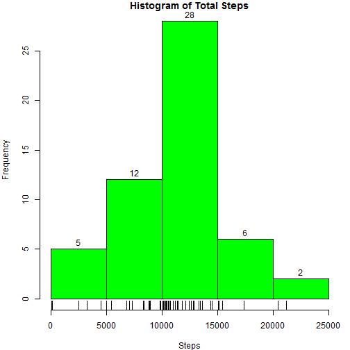
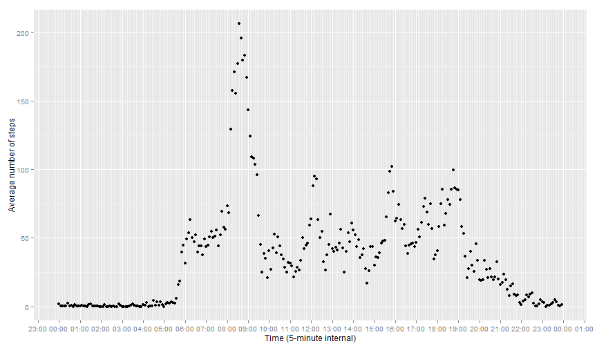
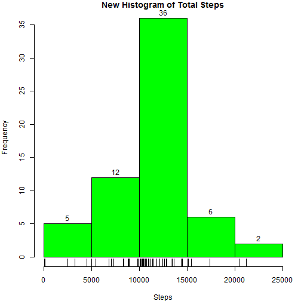
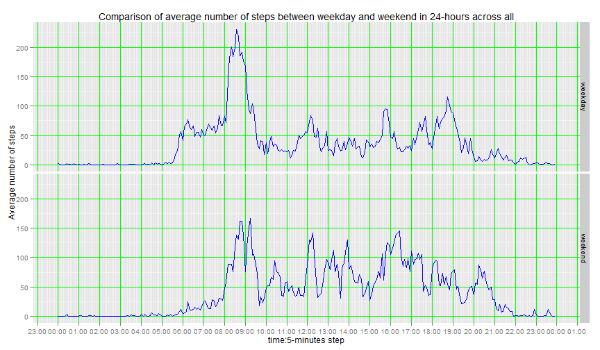

   

###Introduction


It is now possible to collect a large amount of data about personal movement using activity monitoring devices such as a Fitbit, Nike Fuelband, or Jawbone Up. These type of devices are part of the "quantified self" movement - a group of enthusiasts who take measurements about themselves regularly to improve their health, to find patterns in their behavior, or because they are tech geeks. But these data remain under-utilized both because the raw data are hard to obtain and there is a lack of statistical methods and software for processing and interpreting the data.

This assignment makes use of data from a personal activity monitoring device. This device collects data at 5 minute intervals through out the day. The data consists of two months of data from an anonymous individual collected during the months of October and November, 2012 and include the number of steps taken in 5 minute intervals each day.

####Loading and preprocessing the data

* Load the data

First load the required packages for this assignment.

```r
library(dplyr)
library(ggplot2)
library(scales)
```
Then read the table

```r
activity<-read.table("activity.csv",header=TRUE,sep=",")
head(activity)
```

```
##   steps       date interval
## 1    NA 2012-10-01        0
## 2    NA 2012-10-01        5
## 3    NA 2012-10-01       10
## 4    NA 2012-10-01       15
## 5    NA 2012-10-01       20
## 6    NA 2012-10-01       25
```

* Process/transform the data (if necessary) into a format suitable for your analysis
   Remove the missing values for the following analysis.

```r
activity.woNA<-tbl_df(na.omit(activity))
head(activity.woNA)
```

```
## Source: local data frame [6 x 3]
## 
##   steps       date interval
## 1     0 2012-10-02        0
## 2     0 2012-10-02        5
## 3     0 2012-10-02       10
## 4     0 2012-10-02       15
## 5     0 2012-10-02       20
## 6     0 2012-10-02       25
```

####What is mean total number of steps taken per day?

* Make a histogram of the total number of steps taken each day

```r
# Group  data by date
by_date<-group_by(activity.woNA,date)
activity.woNA.sum<-summarize(by_date,sum(steps))
names(activity.woNA.sum)<-c("date","sumsteps")
##1.Make a histogram of the total number of steps taken each day
par(mar=c(4,4,1,1))
hist(activity.woNA.sum$sumsteps,col="green",main="Histogram of Total Steps",xlab="Steps",labels=TRUE)
rug(activity.woNA.sum$sumsteps)
```

 

* Calculate and report the mean and median total number of steps taken per day

```r
activity.woNA.mean<-mean(activity.woNA.sum$sumsteps)
activity.woNA.median<-median(activity.woNA.sum$sumsteps)
activity.woNA.mean
```

```
## [1] 10766.19
```

```r
activity.woNA.median
```

```
## [1] 10765
```

####What is the average daily activity pattern?

* Make a time series plot (i.e. type = "l") of the 5-minute interval (x-axis) and the average number of steps taken, averaged across all days (y-axis)

Please note the minor break in 5-minute interval and 1-hour break on x-axis.

```r
by_interval<-group_by(activity.woNA,interval)
activity.woNA.int.avg<-summarize(by_interval,mean(steps))
names(activity.woNA.int.avg)<-c("interval","meansteps")
# function to convert pattern 800 to 08:00
conv<-function(st){
        st1<-formatC(st,width=4,flag="0")
        paste(substr(st1,1,2),substr(st1,3,4),sep=":")
        
}
activity.woNA.int.avg$interval<-sapply(activity.woNA.int.avg$interval,conv)
activity.woNA.int.avg$time<-as.POSIXct(activity.woNA.int.avg$interval,format="%H:%M")
maxstep<-activity.woNA.int.avg[order(-activity.woNA.int.avg$meansteps),][1,]
ggplot(data = activity.woNA.int.avg, aes(time,meansteps)) + 
        geom_point() + 
        ylab("Average number of steps") + 
        xlab("Time (5-minute internal)") +
        scale_x_datetime(labels = date_format("%H:%M"),breaks = "1 hour",minor_breaks="5 min")
```

 

* Which 5-minute interval, on average across all the days in the dataset, contains the maximum number of steps?

835 (08:35am) interval contains the maximum number of steps.

```r
maxstep<-activity.woNA.int.avg[order(-activity.woNA.int.avg$meansteps),][1,]
maxstep$interval
```

```
## [1] "08:35"
```

 Average daily activity pattern: The average number of steps are increasing gradually since 530 (5:30am) and peaking at 835 (08:35am). Then it starts going down to reach a stage where there exists a fluctuation between 1000 (10:00am) and 1700 (17:00pm) with number of steps varying between around 25 and 100. It is decreasing gradually after 1700 (17:00pm) till midnight.
 
####Imputing missing values
* Calculate and report the total number of missing values in the dataset (i.e. the total number of rows with NAs).

The total number of rows with NAs is 2304.

```r
rowNAs<-colSums(is.na(activity))
rowNAs
```

```
##    steps     date interval 
##     2304        0        0
```

* Devise a strategy for filling in all of the missing values in the dataset. The strategy does not need to be sophisticated. For example, you could use the mean/median for that day, or the mean for that 5-minute interval, etc.

The mean for the 5-minute interval across all days is used to fill the missing values of the related interval.

* Create a new dataset that is equal to the original dataset but with the missing data filled in.
  

```r
by_interval<-group_by(activity.woNA,interval)
activity.woNA.int.avg<-summarize(by_interval,mean(steps))
names(activity.woNA.int.avg)<-c("interval","meansteps")
newactivity<-activity
for(i in 1:nrow(newactivity)){
        if(is.na(newactivity[i,1])){
               t<-filter(activity.woNA.int.avg, interval==newactivity[i,3])
                newactivity[i,1]<-as.integer(ceiling(t$meansteps))# round up to the nearest integer
        }
}
head(newactivity)
```

```
##   steps       date interval
## 1     2 2012-10-01        0
## 2     1 2012-10-01        5
## 3     1 2012-10-01       10
## 4     1 2012-10-01       15
## 5     1 2012-10-01       20
## 6     3 2012-10-01       25
```

```r
newrowNAs<-colSums(is.na(newactivity))
newrowNAs
```

```
##    steps     date interval 
##        0        0        0
```

* Make a histogram of the total number of steps taken each day and Calculate and report the mean and median total number of steps taken per day. Do these values differ from the estimates from the first part of the assignment? What is the impact of imputing missing data on the estimates of the total daily number of steps?


```r
new.by_date<-group_by(newactivity,date)
newactivity.sum<-summarize(new.by_date,sum(steps))
names(newactivity.sum)<-c("date","sumsteps")
par(mar=c(4,4,1,1))
hist(newactivity.sum$sumsteps,col="green",main="New Histogram of Total Steps",xlab="Steps",labels=TRUE)
rug(newactivity.sum$sumsteps)
```

 

```r
newactivity.mean<-mean(newactivity.sum$sumsteps)
newactivity.mean
```

```
## [1] 10784.92
```

```r
newactivity.median<-median(newactivity.sum$sumsteps)
newactivity.median
```

```
## [1] 10909
```
The below table summarizes the mean and median of the two cases. It is obvious that imputing missing data results in the increase of both mean and median on the estimates of the total number of steps taken per day.
  
 Category   |    Dataset-ignore missing values   | Dataset- input missing values
----------- | -----------------------------      | -------------------------
Mean        |         10766.19                   |       10784.92
Median      |         10765                      |       10909

####Are there differences in activity patterns between weekdays and weekends?

For this part the weekdays() function may be of some help here. Use the dataset with the filled-in missing values for this part.

* Create a new factor variable in the dataset with two levels - "weekday" and "weekend" indicating whether a given date is a weekday or weekend day.

Please note the column 'day' contains the factor variable ('weekend' or 'weekday').

```r
newactivity$day1<-weekdays(as.Date(newactivity$date))
newactivity.day<-newactivity %>% mutate(day=ifelse(day1=="Saturday"|day1=="Sunday","weekend","weekday"))
newactivity.day$day<-as.factor(newactivity.day$day)
head(newactivity.day)
```

```
##   steps       date interval   day1     day
## 1     2 2012-10-01        0 Monday weekday
## 2     1 2012-10-01        5 Monday weekday
## 3     1 2012-10-01       10 Monday weekday
## 4     1 2012-10-01       15 Monday weekday
## 5     1 2012-10-01       20 Monday weekday
## 6     3 2012-10-01       25 Monday weekday
```

```r
str(newactivity.day)
```

```
## 'data.frame':	17568 obs. of  5 variables:
##  $ steps   : int  2 1 1 1 1 3 1 1 0 2 ...
##  $ date    : Factor w/ 61 levels "2012-10-01","2012-10-02",..: 1 1 1 1 1 1 1 1 1 1 ...
##  $ interval: int  0 5 10 15 20 25 30 35 40 45 ...
##  $ day1    : chr  "Monday" "Monday" "Monday" "Monday" ...
##  $ day     : Factor w/ 2 levels "weekday","weekend": 1 1 1 1 1 1 1 1 1 1 ...
```

* Make a panel plot containing a time series plot (i.e. type = "l") of the 5-minute interval (x-axis) and the average number of steps taken, averaged across all weekday days or weekend days (y-axis). See the README file in the GitHub repository to see an example of what this plot should look like using simulated data.

```r
by_interval_day<-group_by(newactivity.day,interval,day)
newactivity.day.int.avg<-summarize(by_interval_day,mean(steps))

names(newactivity.day.int.avg)<-c("interval","day","meansteps")
newactivity.day.int.avg$interval<-sapply(newactivity.day.int.avg$interval,conv)
newactivity.day.int.avg$time<-as.POSIXct(newactivity.day.int.avg$interval,format="%H:%M")
maxstep<-activity.woNA.int.avg[order(-activity.woNA.int.avg$meansteps),][1,]
maxstep$interval
```

```
## [1] 835
```

```r
z<-ggplot(data = newactivity.day.int.avg, aes(time,meansteps)) + 
        geom_line(color="blue") + scale_x_datetime(labels = date_format("%H:%M"),breaks = "1 hour",minor_breaks="5 min")+
        labs(title=" Comparison of average number of steps between weekday and weekend in 24-hours across all ")+
        labs(x="time:5-minutes step",y="Average number of steps")+
        facet_grid(day~.)
z+theme(panel.grid.major = element_line(colour = "green"))
```

 

Overall activity patterns between weekdays and weekends looke similar. They both increase gradually since early morning and peak during breakfast time. Then it starts going down to reach a stage where there exists a fluctuation until 2000 (20:00pm).It is decreasing after 2000 (20:00pm). There are difference in the specific time when increasing, peaking and decreasing happen. For instance, steps peaks around 835 (8:35am) for weekdays, while it is around 10 minutes before and after 900 (9:00am) for weekend. Significant steps' increase starts around 530 (5:30am) during weekdays, while it is around 800 (8:00am) for weekend.
